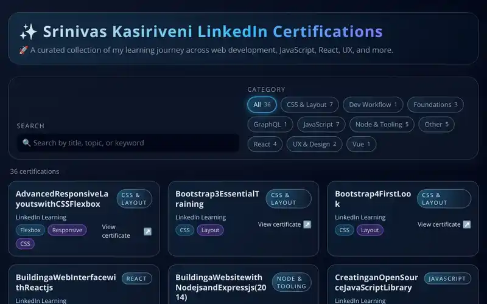

# 📚 LinkedIn Certifications Gallery

A simple, static portfolio site that showcases your LinkedIn Learning certifications.
It’s built with plain HTML, CSS, and JavaScript and is designed to be deployed on Netlify.

## ✨ Features

- Displays a gallery of your LinkedIn Learning certifications
- Search and filter controls for quickly finding specific topics
- Lightweight, fast, and mobile-friendly (no build step or framework)

## 🧱 Project Structure

- [index.html](index.html) – main page and layout
- [styles.css](styles.css) – global styles and layout
- [app.js](app.js) – client-side logic for rendering/filtering certifications
- [certifications/](certifications) – data/assets related to individual certifications

## 🖥️ Running Locally

1. Clone the repository:
	- `git clone https://github.com/<your-username>/linkedin-certifications.git`
	- `cd linkedin-certifications`
2. Open `index.html` directly in your browser **or** serve it with a simple HTTP server, for example:
	- Python 3: `python -m http.server 8000`
	- Node (http-server): `npx http-server .`
3. Visit `http://localhost:8000` (or the URL printed in your terminal).

## 🚀 Deploying to Netlify

This project is configured to deploy automatically from the `master` branch.

- Publish directory: `.` (project root)
- Build command: _none_ (static site)

Once the repo is connected to Netlify, any `git push origin master` will trigger a new deploy.

## 📸 Screenshot

